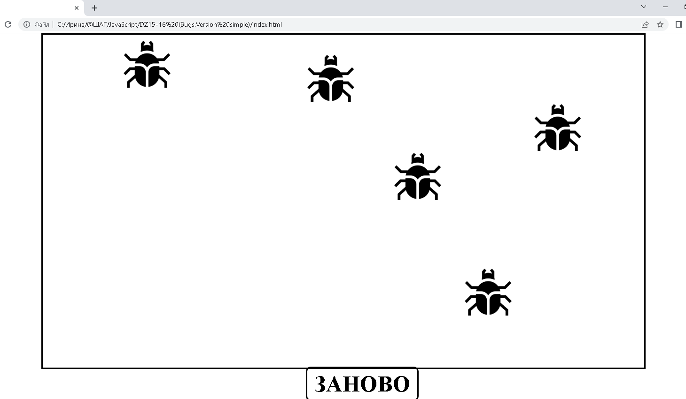
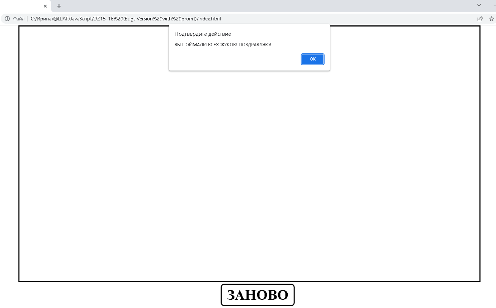

###Проект-игра "Catch the Bugs" ("Поймать жуков")
***
####Технологии:
- JavaScript
- HTML
- CSS
***
####Использование:
1. Запускаете файл index.html

2. Появляется 5 жуков, которые раз в секунду меняют свои координаты. Задача игрока прихлопнуть их всех:

3. После уничтожения последнего жука появляется окно с поздравительной надписью:

4. Кнопка "ЗАНОВО" предназначена для запуска игры сначала

***
##УДАЧИ в ИГРЕ!
